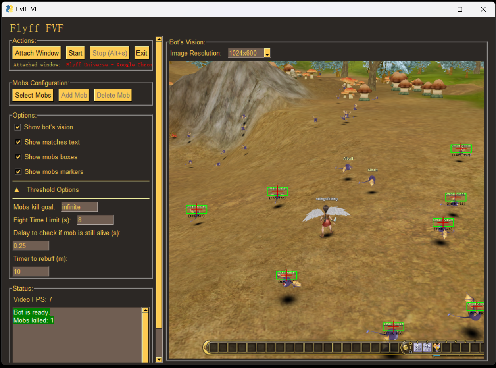
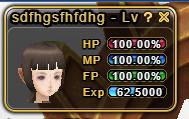
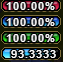
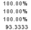

 

  <h3 align="center">My Flyff Bots</h3>

  

	This is a project I built on top of the original forked FlyFF vision bot. I have made the bot compatible with Flyff Universe.
	Please get familiar with the original project first before reaading the rest.
	 
	:warning: Windows only :warning:
     
	 
    <a href="https://github.com/xandao-dev/flyff-bots"><strong>Explore the original project»</strong></a>
     
  

## Improvement on the Foreground Vision Bot

This project made the following improvement on the  Foreground Vision Bot to make it work with Flyff Universe. 
* Added a heal bot that automatically heals the player when the HP drops below 60%.
* Added prioritized handeling of red named mobs.
* Improved the mob selection algorithm to prioritize selecting mobs closeby in the actual 3D space.
* Improved the character patroling algorithm.
* Automatic pickup after killing each mob.
* Automatic self rebuff every certain time interval.
  
UI changes
* Replaced "Timer to convert penya to perins" option with the "Time to rebuff" option

### Game Setup Requirement
Make the following keyboard setup:

1 = auto attack. You could also change the code to make it attack by pressing C to cast spells from action bar or other key slot

2 = pick up

3 = heal

C = buffs action bar

N = cancel target

Because Flyff Universe is played on a browser. We cannot take a screen shot of it in background. Therefore, you need to have 2 screens. Play the game in a 1920*1080 resolution main screen. Press F11 to maximize your game. Move the bot UI to a secondary screen.

Put your camera view angle at around 30-40 degrees above ground and zoom it to a distance that is not too close or too far. Make the infinite ground horizon just be at the very top of your screen.

Set your interface theme to Gold. Put your character status window containing the health bar to the top left corner of your game interface. Change the window size to the smallest and set the display to percentage.

The reason for such setup is that the bot will determine the player's health by taking a screen shot of your health window and parse its health percentage values.

   Parsed into        

Remove any useless icon from your screen, such as the notification, battle pass, achievements, and events icon. They are typically under your character status window and can be removed by clicking them. 

Hide all your buffs.

### Installation

To make the text recognition work, you need to install pytesseract. You can search google how to install that

Install tesseract for windows. You need to visit the Windows section of this link:
https://tesseract-ocr.github.io/tessdoc/Installation.html

To access tesseract-OCR from any location, you may have to add the directory where the tesseract-OCR binaries are located to the Path variables, maybe something like C:\Program Files\Tesseract-OCR.

To do that, refer to here: https://www.geeksforgeeks.org/how-to-set-up-command-prompt-for-python-in-windows10/
